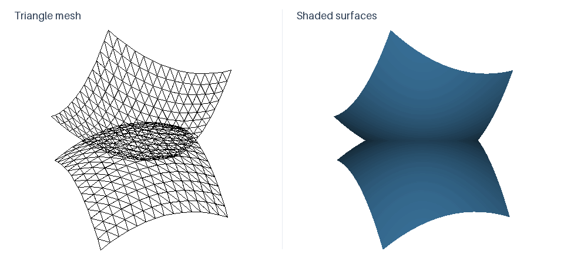

# Bézier Surface Renderer

A desktop program for drawing two bicubic Bézier surfaces. Each surface is defined
by a 4 × 4 grid of control points and approximated by a triangle mesh. The program
renders the surfaces with diffuse and specular lighting, image textures, and
optional normal mapping.



*The supplied surfaces, shown with a triangle mesh (left) and shaded faces (right).
This loop is generated with the application's renderer, not recorded from the interface.*

## Using the renderer

The controls below the viewport adjust the first surface's rotation and the number
of subdivisions used for both surfaces. The control mesh, triangle mesh, and filled
faces can be toggled independently. Random rotation animates both surfaces.

Lighting controls set the diffuse and specular reflection coefficients, the
specular exponent, and the light's height and colour. The light can also move along
a spiral path. Use **Choose Color** or **Load Texture** to set the surface colour,
and **Load Normal Map** followed by **Enable Normal Mapping** to add surface detail
without changing the geometry.

## Requirements

- Python 3.8 or later, including Tkinter
- A C/C++ compiler supported by Cython (Microsoft C++ Build Tools on Windows)

## Setup

From the repository root, install the dependencies and build the Cython modules:

```powershell
python -m pip install setuptools wheel Cython numpy Pillow
python setup.py build_ext
```

Run the application from the same directory:

```powershell
python main.py
```

## Surface data and implementation

The application reads `control_points.txt` and `control_points2.txt` on startup.
Each file contains 16 lines of space-separated `x y z` coordinates, read row by row
into a 4 × 4 grid. Edit these files to change the surfaces. The repository also
includes two example normal maps: `normal_map.jpg` and `brick_normalmap.png`.

Tkinter provides the interface, and Pillow displays the rendered image. Surface
evaluation, rotation, triangulation, and rasterization are implemented in Cython.
Filled triangles share a depth buffer; mesh lines are drawn over the filled image.

To regenerate the demonstration after building the modules, run
`python docs/generate_demo.py` from the repository root.
